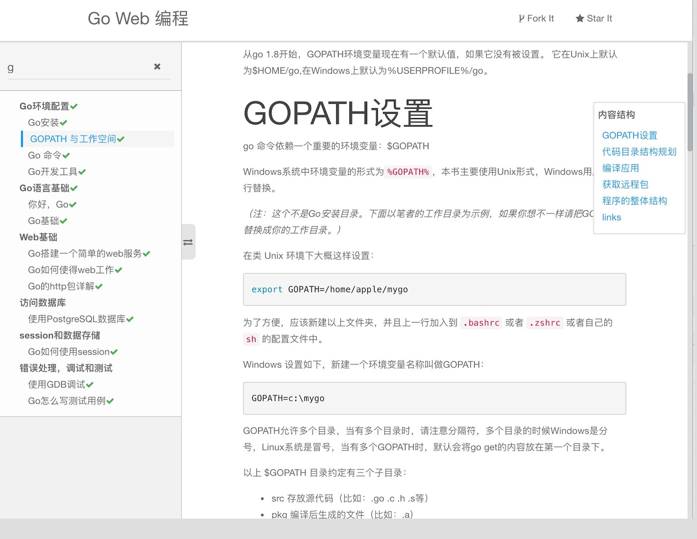

# markdown documents site reader

一个非常简单的markdown文档站点阅读器小工具，自动拉取目录数据并生成目录侧边栏，自动根据文档生成TOC

- 纯静态渲染，只要有一个可以放静态文件的服务器, 配置好相关信息。访问 `index.html` 即可
- 原生支持渲染 gitbook 导出的 markdown 站点
- 可直接渲染github上的任意一个 markdown 文档仓库，无需拉取仓库代码
- 简单的目录搜索功能支持(会将目录的 链接文字和链接href 作为匹配目标)
- 样式使用基于bootstrap 3 的 bootswatch(可以直接在页面底部切换各种主题)
- 自动缓存内容到本地(localSorage)，加快二次打开速度
- 使用highlight添加代码高亮支持

## 项目仓库

- **github** https://github.com/inhere/md-site-reader.git
- **git@osc** https://git.oschina.net/inhere/md-site-reader.git

## 示例

**示例文档** https://inhere.github.io/md-site-reader/

示例渲染的是 @astaxie 的github项目 [《Go web 编程》](https://github.com/astaxie/build-web-application-with-golang)

- 示例访问的就是当前仓库的 `index.html`
- 示例配置请看文件 `config.js`
- 效果预览：



## 更多books

请看 https://git-books.github.io/

收集了一些github上的书籍文档

## 使用以及配置

你可以通过 `config.js` 来覆盖默认配置, 然后访问 `index.html` 即可

### 全部配置项

```js
// file: assets/js/config.defalut.js
{
  // use for cache prefix
  siteKey: 'swoft',
  siteName: 'Swoft',
  siteDes: 'the description text',
  // page title = baseTile + content title
  baseTitle: 'Swoft Doc',
  // basePath: ,
  logoUrl: '/',

  docProject: 'swoft-cloud/swoft-doc',
  // e.g https://raw.githubusercontent.com/{swoft-cloud/swoft-doc}/master/{beanfactory.md}
  dataUrl: 'https://raw.githubusercontent.com/swoft-cloud/swoft-doc/master/',
  docUrl: 'https://github.com/swoft-cloud/swoft-doc',
  // e.g https://github.com/swoft-cloud/swoft-doc/edit/master/http.md
  editUrl: 'https://github.com/swoft-cloud/swoft-doc/edit/master',

  project: 'swoft-cloud/swoft',
  projectUrl: 'https://github.com/swoft-cloud/swoft',
  issueUrl: 'https://github.com/swoft-cloud/swoft/issues',

  authorPage: 'https://github.com/stelin',
  authorName: 'stelin',

  emptyData: 'No content to display!',
  catelogPage: 'SUMMARY.md',
  defaultPage: 'README.md',

  // assets/lib/bootswatch/{theme:paper}/bootstrap.min.css
  theme: 'paper',
  // assets/lib/highlight/styles/{codeTheme:github}.css
  codeTheme: 'github',
  makeTOC: true,
  /* £ $ & β ξ ψ ℘ § */
  anchorIcon: '℘',
  tableClass: 'table table-bordered table-striped'
}
```

## License

MIT
